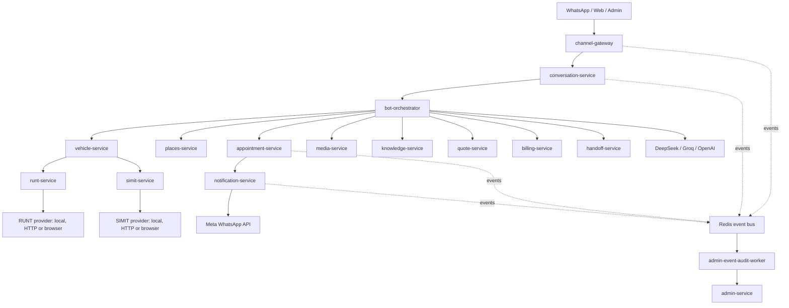

# Civi microservices architecture

## Topology



## Internal service shape

Each Python service keeps the same internal structure:

```text
src/<service_package>/
  main.py
  slices/<use_case>/
    api.py
    schemas.py
    use_case.py
  adapters/outbound/
  shared/
```

Rules:

- use cases do not depend on other service packages;
- outbound integration uses internal HTTP contracts or events;
- provider calls are env-gated and disabled by default locally;
- workers do not expose public ports.

`runt-service` and `simit-service` are the only services allowed to know how external vehicle providers work. `vehicle-service` only calls their internal APIs, and `bot-orchestrator` only calls `vehicle-service`. `knowledge-service` owns deterministic domain explanations from the legacy tool surface so the LLM does not invent rules. The browser provider runs behind those service boundaries; the bot never automates public portals directly.

## Bot ownership

`bot-orchestrator` owns prompt assembly, intent routing, tool selection and response validation. Domain facts stay in domain services. If the bot says it checked a domain, that answer must come from a tool result.

## Data ownership

The local compose uses one PostgreSQL instance for developer convenience, but tables are logically owned by service prefixes and checked by `scripts/verify-data-ownership.py`.

## Acceptance rule

The architecture is considered valid when `scripts/verify.ps1`, compose config and local smoke pass without retired runtime code.
