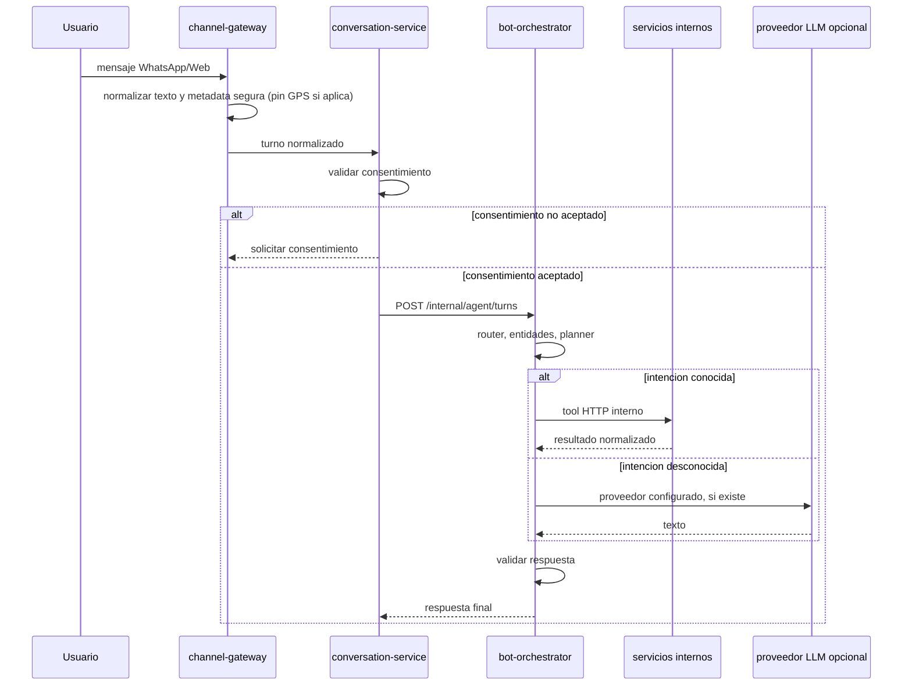

# Bot orchestrator flow

## Entry sequence

## Native tools

- `vehicle.check_vigencia`
- `vehicle.consult_multas`
- `vehicle.consult_runt_profile`
- `places.find_nearest`
- `appointment.select_place` as an internal bot state transition before scheduling when multiple centers are available
- `appointment.create`
- `appointment.list`
- `appointment.cancel`
- `notification.schedule`
- `knowledge.get_info` for deterministic tecnomecanica and CIA knowledge that existed as legacy tools
- `knowledge.city_info` for city coverage notes without inventing volatile local traffic rules
- `quote.create` for generic bands plus exact SOAT, tecnomecanica, CIA course and CNT infraction quotes when the user provides enough inputs
- `billing.payment_intent.create`
- `handoff.create`
- `llm.complete`

## Fallback LLM

The LLM is a fallback, not the owner of domain truth. Known flows use internal tools first. If a provider is disabled, the bot returns the safe Civi menu for unsupported questions.

Vehicle facts are never generated by the LLM. For SOAT, RTM or SIMIT, the bot calls `vehicle-service`; that service calls `runt-service` or `simit-service`, and those services decide whether to use local mode, HTTP provider mode or browser provider mode. Domain rules such as tecnomecanica documents, CIA discounts and known coverage notes come from `knowledge-service`.

## Location metadata

WhatsApp `location` messages are accepted by `channel-gateway` and passed as turn `metadata` through `conversation-service` into `bot-orchestrator`. The gateway validates that coordinates are inside Colombia before forwarding `location_lat/location_lng` and `geo_lat/geo_lng`.

For appointment flows, `bot-orchestrator` uses a real pin before asking for city. If the user first asks to schedule a known procedure but does not provide city or pin, the bot saves a pending appointment context and resumes `places.find_nearest` when the next message supplies either a city or a valid location pin.
